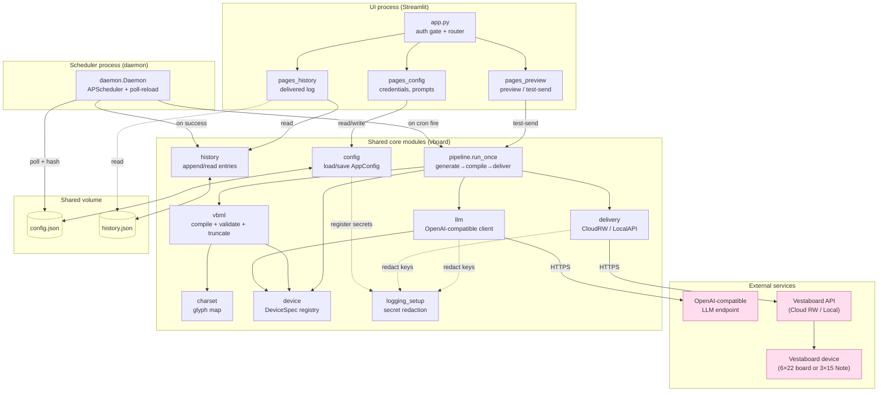
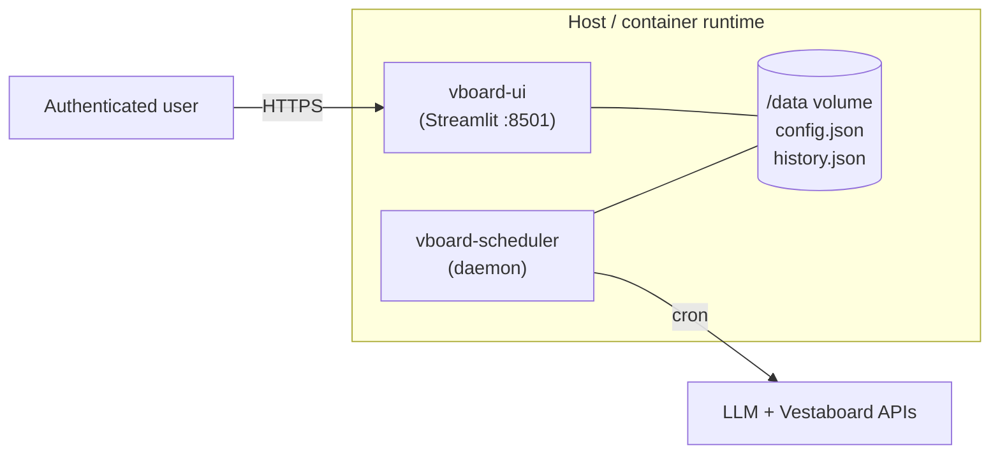

# Architecture

Vestaboard AI runs as **two independent processes** that share state through two
files on a common volume — a `config.json` (managed by the UI) and a
`history.json` (appended by the scheduler). There is no message bus or database:
the shared files *are* the integration point.

- **Streamlit UI** — authenticated configuration surface. Writes `config.json`,
  reads `history.json`, can preview/test-send on demand.
- **Scheduler daemon** — headless. Reads `config.json`, fires generation →
  delivery on cron schedules, appends to `history.json`.

The daemon detects config changes by hashing the file contents (SHA-256), so a
UI save is picked up on the next poll without a restart.

## Component diagram

## Module responsibilities

| Module | Role |
|--------|------|
| `config` | Single JSON store. Pydantic `AppConfig`: Vestaboard creds + device, LLM endpoint, password hash, prompt entries. Atomic write (temp file + `os.replace`, `0o600`). |
| `device` | `DeviceSpec` registry — lines/cols/content-limit + centering offsets for `vestaboard` (6×22, 132) and `note` (3×15, 45). Source of truth for limits. |
| `llm` | OpenAI-compatible client. Builds device-aware system prompt, `generate()` + `check_connection()`. Never leaks the key. |
| `vbml` | Plain text → VBML → 6×22 code grid. Maps to charset, enforces content + glyph limits, `truncate_to_fit` fallback. Last gate before delivery. |
| `charset` | Vestaboard glyph code map; `is_supported()`. |
| `delivery` | `VBoard` protocol + `CloudRW` (live) and `LocalAPI` (deferred). Backend chosen by config. |
| `pipeline` | `run_once`: generate → compile → (retry shorter ×3) → truncate fallback → deliver. Returns `PipelineResult` (never raises). |
| `daemon` | APScheduler `BackgroundScheduler`. `sync_jobs` from config, `maybe_reload` on content-hash change, `_fire` per prompt, records history on success. |
| `history` | Append/read `HistoryEntry` (text, device, grid, timestamp) to `history.json`. Best-effort — write failure never breaks a delivered run. |
| `logging_setup` | Secret registration + redaction. Keys never logged at any level. |
| `ui/*` | Streamlit auth gate (bcrypt) + Credentials / Prompts / Preview / History pages. |

## Deployment

Two services share one volume — run as systemd units (`deploy/`) or containers
(`Dockerfile` + `compose.yml`, UI on `127.0.0.1:8501`, both mounting
`vboard-config` at `/data`).

