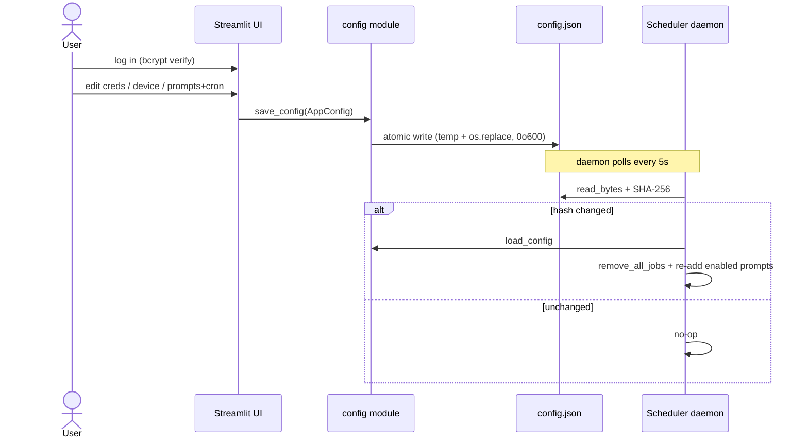
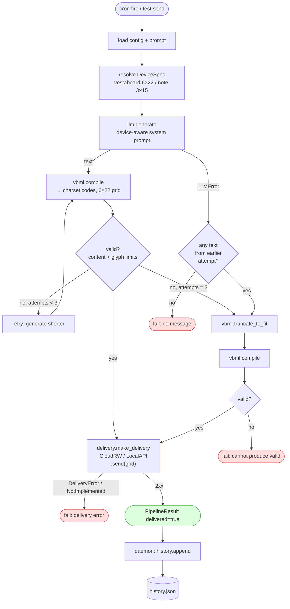
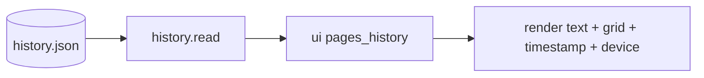

# Data Flow

Two flows drive the system: **configuration** (user → `config.json`) and
**generation/delivery** (cron → board). They meet only at the shared files.

## 1. Configuration flow

Config change is detected by hashing **file contents**, not mtime — a same-second
edit can't be missed. No restart needed.

## 2. Generation & delivery flow (`pipeline.run_once`)

Triggered by a cron job in the daemon, or by the UI's "test-send" button.

### Key behaviors

- **Up to 3 attempts.** Each invalid compile re-prompts the LLM with a
  "make it shorter" suffix before falling back to hard truncation.
- **LLM error short-circuits retries** but does *not* discard usable text from an
  earlier attempt — it falls through to the truncate fallback.
- **Two failure exits** are distinct: `no message` (LLM gave nothing) vs
  `cannot produce valid` (even truncated text won't fit the charset/limits).
- **`run_once` never raises** — returns `PipelineResult`. The daemon inspects
  `.delivered`; APScheduler would otherwise report success on a silent failure.
- **History is best-effort** — written only on success, and a write failure is
  logged but never breaks the already-delivered run.

## 3. History read flow

## Secret handling across flows

Every credential (`cloud_key`, `local_key`, `llm.api_key`) is registered with
`logging_setup` on config load and on delivery/LLM client construction, so keys
are redacted from all log output and never appear in tracebacks. The password is
stored only as a bcrypt hash.
